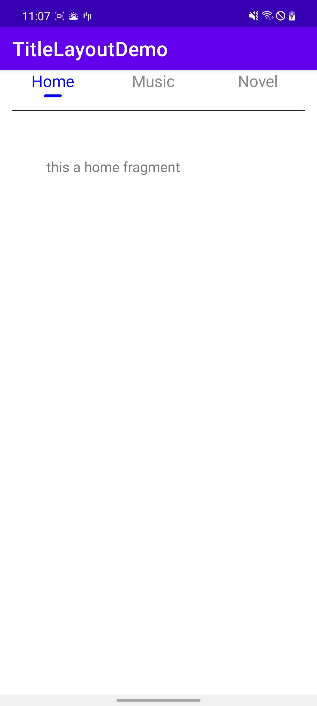
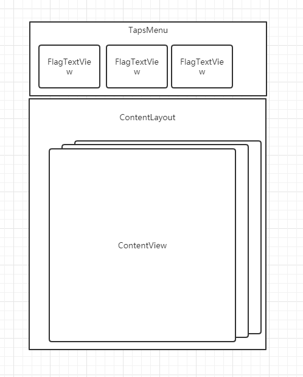

# TitleLayoutDemo

## 需求：

之前看浏览器有很方便的布局结构，文字标题栏，和它所对应的布局，可以通过点击标题栏或者滑动视图来进行切换。有点好奇，想自己弄一个，虽然有官方API提供的FragmentPagerAdapter+ViewPager+TabLayout可以实现相同的效果。如果我想自定里面的下划线长度，颜色，边距等的具体参数会不是那么方便。为了自己的方便，我决定模拟一下这个功能。

效果如下：




结构分析：主要分上下2层：标题区和内容区。




标题区：字符串命名，带下划线，被选中的项会染上蓝色，点击标题区可以切换内容区。包含以下：

子容器：FlagTextView

FlagTextView绘制了字体和下划线的颜色和大小，存储了对应的内容区对象。

父容器：TapsMenu

TapsMenu负责排列FlagTextView和进行点击时的切换操作。


内容区（ContentLayout）：里面显示独立的内容，和标题区关联，水平滑动内容区可以切换标题区的选择。

内容图（ContentView）：布局类，存储对应的FlagTextView。


Android 自制个人deepseek搜索工具

# 国产Deepseek AI搜索的火热让不少国内开发者为之骄傲

为了玩一下最新的AI搜索，我在手机上自制了简陋的搜索工具，纯属自娱自乐。

## 首先获取deepseek的api key
访问官方网站https://platform.deepseek.com/进行注册，创建api key,首次创建成功后要马上复制保存，后面不能复制了。需要先充值，否则也不能使用API


## 创建deepseek网络客户端进行访问
代码如下：

```kotlin
class DeepSeekApiClient (callback:DeepSeekResult){
    private val client = OkHttpClient().newBuilder()
        .connectTimeout(60,TimeUnit.SECONDS)
        .readTimeout(60,TimeUnit.SECONDS).build()
    private val apiKey = "sk-e7a882d208464257a28b84bdb03f0e" // 替换为你的API密钥
    private val apiUrl = "https://api.deepseek.com/v1/chat/completions"

    private val resultCallback = callback

    fun sendRequest(prompt: String) {
        val mediaType = "application/json".toMediaTypeOrNull()
        val requestBody = RequestBody.create(
            mediaType,
            """
            {
                "model": "deepseek-chat",
                "messages": [
                    {"role": "user", "content": "$prompt"}
                ]
            }
            """.trimIndent()
        )

        val request = Request.Builder()
            .url(apiUrl)
            .post(requestBody)
            .addHeader("Content-Type", "application/json")
            .addHeader("Authorization", "Bearer $apiKey")
            .build()
        client.newCall(request).enqueue(object : Callback {
            override fun onFailure(call: Call, e: IOException) {
                // 处理请求失败
                e.printStackTrace()
            }

            override fun onResponse(call: Call, response: Response) {
                if (!response.isSuccessful) {
                    // 处理响应失败
                    throw IOException("Unexpected code ${response.code}")
                }

                // 处理响应成功
                val responseBody = response.body?.string()
                Log.e("onResponse","responseBody:$responseBody")
                if (responseBody != null) {
                    val jsonObject = JSONObject(responseBody)
                    val choices  = jsonObject.getJSONArray("choices")[0] as JSONObject
                    val message = choices.getJSONObject("message")
                    val content  = message.get("content")
                    resultCallback.onResult(content.toString())
                }
                println(responseBody)
            }
        })
    }
}

interface DeepSeekResult{
    fun onResult(resut:String)
}
```
AI搜索需要耗时较长，网络连接时间和读取时间都需要设置大一些，否则容易出现网络超时的结果，我这里设置60秒，使用接口对象返回搜索访问结果。
## 创建Room数据库表保存搜索结果

创建实体类

```kotlin
@Entity(tableName = "searchinfos")
data class SearchInfo(
    @PrimaryKey(autoGenerate = true) val id: Int,
    val date: String?,
    val search_question: String?,
    @NonNull var search_result: String, // 确保非空
    @NonNull var is_favourite: Int, // 确保非空
    @NonNull var is_selected:Int = 0
)
```
创建对应的Dao

```kotlin
@Dao
interface SearchInfoDao {
    @Query("SELECT * FROM searchinfos")
    fun getAll(): Flow<List<SearchInfo>>

    @Query("SELECT * FROM searchinfos WHERE id IN (:userIds)")
    fun loadAllByIds(userIds: IntArray): List<SearchInfo>

    @Query("SELECT * FROM searchinfos WHERE search_question LIKE :searchInfo AND " +
            "date LIKE :datetime LIMIT 1")
    fun findByName(searchInfo: String, datetime: String): SearchInfo

    @Update
    fun updateSearchInfos(searchInfos: List<SearchInfo>): Single<Int>

    @Insert
    fun insertAll(vararg searchInfo: SearchInfo)

    @Delete
    fun delete(searchInfo: SearchInfo)
}
```
创建数据库类

```kotlin
@Database(entities = [User::class,SearchInfo::class], version = 4)
abstract class AppDatabase : RoomDatabase() {
    abstract fun userDao(): UserDao
    abstract fun searchDao():SearchInfoDao

}
```
使用对象类调用，拒绝被频繁创建

```kotlin
object AppDBHandler {
    private var db: AppDatabase? = null

    fun getRoomDBObject(): AppDatabase? {
        return db
    }

    fun buildDBFile(context: Context){
        val dbPath = context.getDatabasePath("my_database.db").path
        Log.d("Database", "Path: $dbPath")  // 输出路径确认
        try {
            db = Room.databaseBuilder(
                context,
                AppDatabase::class.java,
                "my_database.db"
            ).build()
        } catch (e: Exception) {
            Log.e("Database", "初始化失败: ${e.message}")
            e.printStackTrace()
        } finally {
            Log.e("Database", "初始化成功")
        }
    }
}
```

## 设置搜索布局

```kotlin
<?xml version="1.0" encoding="utf-8"?>
<FrameLayout xmlns:android="http://schemas.android.com/apk/res/android"
    android:layout_width="match_parent"
    android:layout_height="match_parent">
    <LinearLayout
        android:layout_width="match_parent"
        android:layout_height="wrap_content"
        android:orientation="vertical">

        <SearchView
            android:id="@+id/deepseek_search"
            android:layout_width="match_parent"
            android:layout_height="wrap_content">
        </SearchView>

        <ScrollView
            android:layout_width="wrap_content"
            android:layout_height="wrap_content">
            <androidx.recyclerview.widget.RecyclerView
                android:id="@+id/history_recyclerview"
                android:layout_width="match_parent"
                android:layout_height="wrap_content">
            </androidx.recyclerview.widget.RecyclerView>

        </ScrollView>
        <ScrollView
            android:layout_width="wrap_content"
            android:layout_height="wrap_content">

            <TextView
                android:id="@+id/search_result"
                android:layout_width="wrap_content"
                android:layout_height="wrap_content">
            </TextView>
        </ScrollView>
    </LinearLayout>
</FrameLayout>
```
进行API调用，获取到回应后把结果插入数据库，刷新页面显示结果。

```kotlin
private fun initDeepSeekSearch() {
        val result = object : DeepSeekResult{
            override fun onResult(result: String) {
                GlobalScope.launch {
                    withContext(Dispatchers.IO){
                        if (searchInfo != null) {
                            searchInfo!!.search_result = result
                            searchDao.insertAll(searchInfo!!)
                        }
                    }
                    withContext(Dispatchers.Main){
                        binding.searchResult.text = result
                        waitingDialog.hide()
                    }
                }
            }
        }
        val client = DeepSeekApiClient(result)
        client.sendRequest("Hello, DeepSeek!")
        waitingDialog.show()
        binding.deepseekSearch.setSuggestionsAdapter(suggestionsAdapter)
        binding.deepseekSearch.setOnQueryTextListener(object : SearchView.OnQueryTextListener,
            android.widget.SearchView.OnQueryTextListener {
            override fun onQueryTextSubmit(query: String?): Boolean {
                if (query != null) {
                    GlobalScope.launch {
                        withContext(Dispatchers.IO){
                            val calendar = Calendar.getInstance()
                            val dateFormat = SimpleDateFormat("yyyy-MM-dd HH:mm:ss")
                            val formatted = dateFormat.format(calendar.time)
                            searchInfo = SearchInfo(0,formatted,query,"",0,0)
                            client.sendRequest(query)
                        }
                        withContext(Dispatchers.Main){
                            waitingDialog.show()
                        }
                    }
                }
                return false
            }

            override fun onQueryTextChange(newText: String?): Boolean {
                return false
            }
        })

    }
```

切换不同的历史搜索结果

```kotlin
private fun initFlowLayout() {
        val recycler = binding.historyRecyclerview
        recycler.layoutManager = FlowLayoutManager()
        searchDao = AppDBHandler.getRoomDBObject()!!.searchDao()
        GlobalScope.launch {
            searchDao.getAll().collect{
                recycler.adapter = SearchHistoryAdapter(R.layout.flow_list,
                    it as ArrayList<SearchInfo>
                )
            }
        }
        recycler.addOnItemTouchListener(object :OnItemTouchListener{
            override fun onInterceptTouchEvent(rv: RecyclerView, e: MotionEvent): Boolean {
                val childView = rv.findChildViewUnder(e.getX(), e.getY());
                if (childView != null && e.getAction() == MotionEvent.ACTION_UP) {
                    val position = rv.getChildAdapterPosition(childView)
                    GlobalScope.launch {
                        searchDao.getAll().collect{
                            withContext(Dispatchers.Main) {
                                it[position].is_selected = 1
                                recycler.adapter = SearchHistoryAdapter(R.layout.flow_list,
                                    it as ArrayList<SearchInfo>)
                                binding.searchResult.text = it[position].search_result
                            }
                        }
                    }
                }
                return false
            }

            override fun onTouchEvent(rv: RecyclerView, e: MotionEvent) {
            }

            override fun onRequestDisallowInterceptTouchEvent(disallowIntercept: Boolean) {
            }
        })
    }
```

展示效果：
获取deepseek的响应

切换不同的搜索历史纪录

历史记录列表和搜索结果都使用了ScrollView进行包裹，可以进行翻滚，完成基本版搜索工具。
